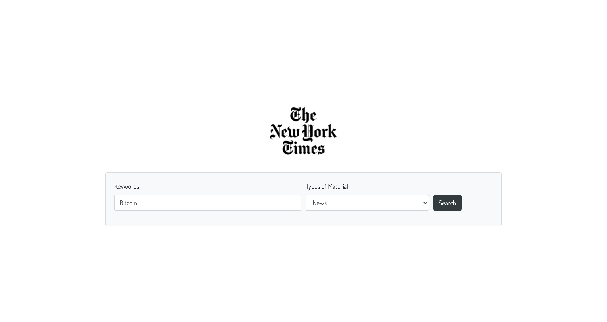
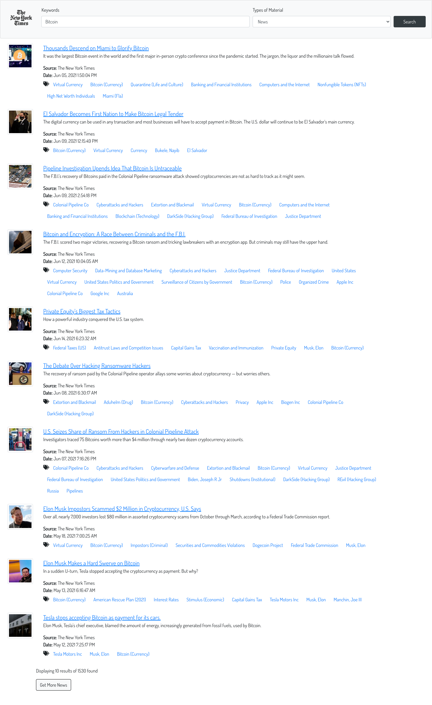

# 📰 NYT App build with React 📄

## Configuration

After downloading the project, go to the root folder and use

```
npm install
```

This will download our app dependencies.

Now, let's configure our NYT_API Credentials. For this, we have to rename the file **.env.example** to _**.env**_.

Open the file and paste your NYT_API Key obtained from https://developer.nytimes.com/ right there REACT_APP_API_KEY=**YOUR_KEY**.

That's all. Now run it with 

```
npm start
```


## Demo

<a href="https://jeangel.github.io/nyt-app/" target="_blank">Online NYT app demo</a>

## Example image


